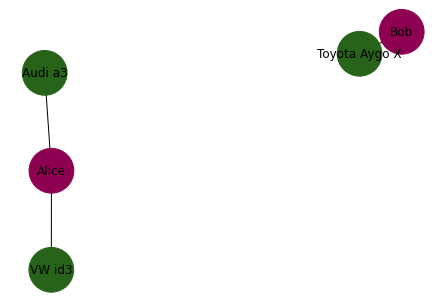
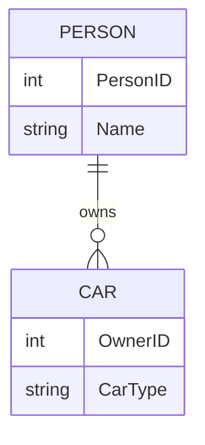

# 🦑🐼🐍 RelationalPandas - Enrich your DataFrames by Relations


[](https://florianteich.github.io/RelationalPandas/)
[](https://mybinder.org/v2/gh/FlorianTeich/RelationalPandas/HEAD?labpath=notebooks%2F)
[](https://florianteich-relationalpandas-streamlit-app-goc51c.streamlit.app)

## Abstract

Define relationships between dataframes in order to visually inspect your data more comfortable.

## Introduction

Ever worked on multiple DataFrames that are somehow semantically related (e.g. by referencing each other)?
Take these two DataFrames for instance:

| PersonID | Name  |
|----------|-------|
| 0        | Bob   |
| 1        | Alice |

| CarType       | OwnerID |
|---------------|---------|
| VW id3        | 1       |
| Toyota Aygo X | 0       |
| Audi a3       | 1       |

I wish there was a better way to inspect the data visually than to stare at these tables.
I want to be able to reorganize the entirety of data as a knowledge graph to reflect the inherent relationship between the involved objects.
Here is the same data but reorganized and visualized given the relation between the entities:






## ✨ Installation

``` bash
git clone https://github.com/FlorianTeich/RelationalPandas
cd RelationalPandas
pip install -e .
```

## 🚀 Quickstart

``` python
import pandas as pd
import RelationalPandas as rp

df1 = pd.DataFrame({
            "PersonID": [0, 1],
            "Name": ["Bob", "Alice"]
        })
df2 = pd.DataFrame({
            "CarType": ["VW id3", "Toyota Aygo X", "Audi a3"],
            "OwnerID": [1, 0, 1]
        })

collection = rp.Collection()
collection.register_scene({
        "dataframes": [
            {
                "name": "Name",
                "data": df1,
                "entity_column": "PersonID"
            },
            {
                "name": "CarType",
                "data": df2,
                "entity_column": "OwnerID"
            }
        ],
        "relations": [
            [df1, df2, "PersonID", "OwnerID"]
        ]
    })
collection.visualize_instances()
```

## 🪣 TODOs:

- [ ] Documentation
- [ ] Dockerfile
- [ ] mypy Support
- [ ] coverage
- [ ] versioneer
- [ ] pre-commit-hook black
- [ ] isort Support
